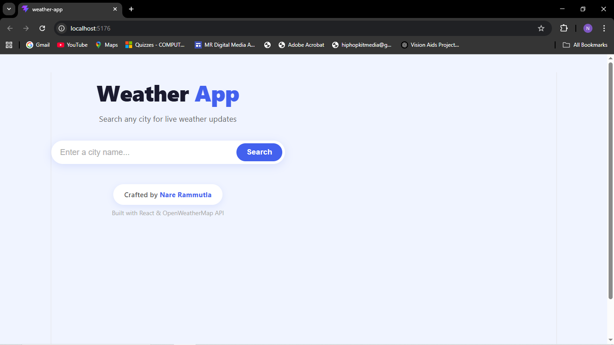
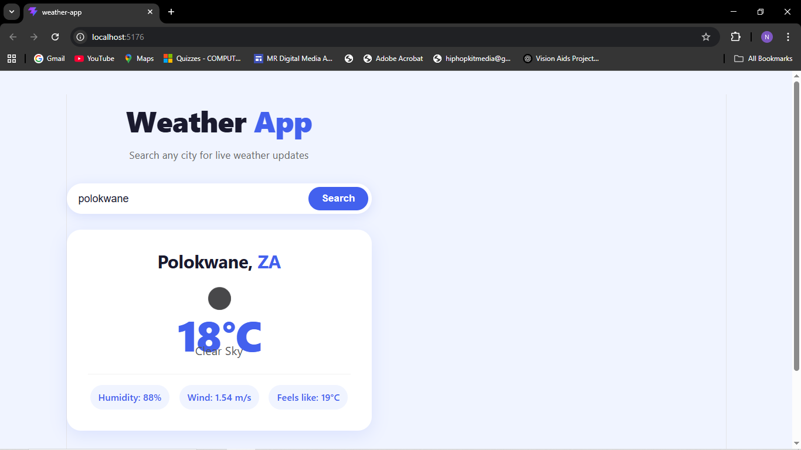
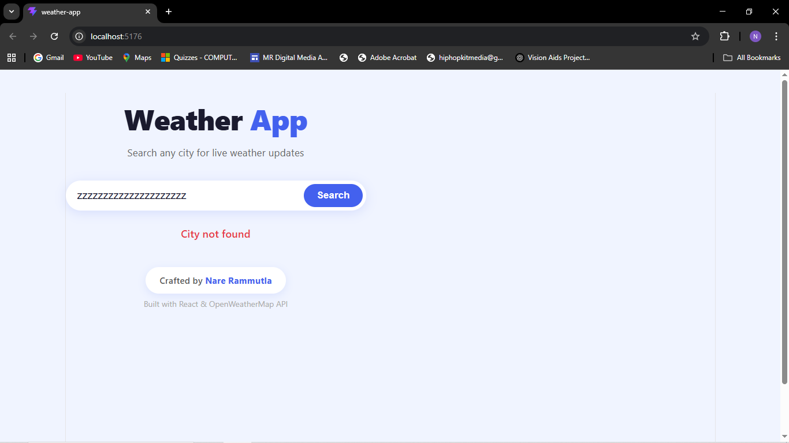

# Weather App

A clean, modern weather app built with React. Search any city in the world to get live weather updates including temperature, humidity, wind speed, and conditions.

## Screenshots

### Home Screen


### Weather Result


### Weather Result


### Weather Result


## Live Features
- Search any city worldwide
- Displays current temperature in °C
- Shows humidity, wind speed & feels like temperature
- Weather condition icons
- Clean bright & modern UI
- Error handling for invalid cities

## Built With
- [React](https://reactjs.org/)
- [Vite](https://vitejs.dev/)
- [OpenWeatherMap API](https://openweathermap.org/api)

##  How to Run Locally

1. Clone the repo
```bash
   git clone https://github.com/YOUR_USERNAME/weather-app.git
```
2. Navigate into the project
```bash
   cd weather-app
```
3. Install dependencies
```bash
   npm install
```
4. Add your API key in `src/App.jsx`
```js
   const API_KEY = 'your_api_key_here';
```
5. Start the app
```bash
   npm run dev
```

